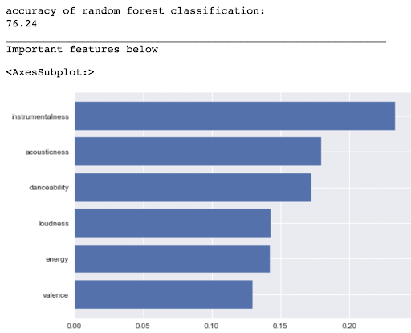

# Spotify Prediction

## About

Spotify is a digital music, podcast, and video service that gives you access to millions of songs and other content from creators all over the world. As of 2022, it has 82 million songs on its platform, an estimated 8 million artists and creators on its platform and 406 million active monthly users. Ever wondered how much money your favourite artists and singers are earning from spotify for their songs? $0.0033 to $0.0054. That means it would take roughly 250 streams for an artist to earn $1.
Popularity of a song becomes a huge factor that has a direct correlation with the number of streams and an artist’s revenue.

With that, here are some of the questions we seek to answer:

- What are the different variables that affect a song’s popularity on spotify?
- Can we accurately predict whether a song will be popular given numerical statistics of the song’s traits?

## Takeaways

Through the use of the decision tree and random forest classifier, our data driven insight from the small dataset of 40,000 songs is that **Instrumentalness** is the most important factor in predicting the popularity of a song. More specifically, a lower instrumentalness (more vocals) is more popular with listeners.

However, our model is not perfect and there are many other factors that were not accounted for. For example, song themes, popularity of the music artist, and the shift in trends of music over the decades. Despite these limitations, our model provides a good starting point for exploring how different song traits impact the popularity of a song.

## Contributors

- [@agentzhao](https://github.com/agentzhao/) - Data Cleaning, Analysis and Visualization
- [@bohyanggg](https://github.com/bohyanggg/) - Machine Learning and AI

## Tools

- Python 3
- Jupyter Notebook
- Pandas
- Numpy
- Matplotlib
- Seaborn
- Scikit-Learn
- Wordcloud
- Yellowbrick

## Machine Learning

- Decision Tree (Uni and Multi-Variate) - Highest Univariate Decision tree with 68.9% accuracy
- Random Forest Classifier - Best Model, with a 76.2% accuracy
- Support Vector Clustering - 71.2% accuracy
- -KNeighborsClassifier - 70.6% accuracy

## References

- Dataset retrieved from [Kaggle](https://www.kaggle.com/datasets/akiboy96/spotify-dataset)
- [Spotify Says It Paid $7 Billion In Royalties In 2021 Amid Claims Of Low Pay From Artists](https://www.forbes.com/sites/marisadellatto/2022/03/24/spotify-says-it-paid-7-billion-in-royalties-in-2021-amid-claims-of-low-pay-from-artists/?sh=2062a500a0db)
- [How Musicians Are Fighting for Streaming Pay During the Pandemic](https://pitchfork.com/features/article/how-musicians-are-fighting-for-streaming-pay-during-the-pandemic/)
- [The evolution of music: How genres rise and fall over time](https://www.latimes.com/visuals/graphics/la-sci-g-music-evolution-20150505-htmlstory.html/)
